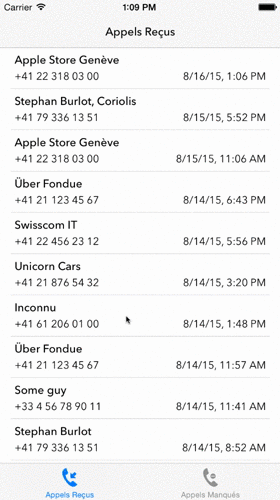

# Swisscom PhoneCalls

If your Swiss fixed phone provider is Swisscom and you have IP telephony, there's an option on the Swisscom portal to have a list of all your answered and missed calls.

These scripts will fetch the info from the Swisscom website, populate a database and feed the result to an iPhone app.

The iPhone app shows all answered and missed calls, and if you grant access to your address book, the contact names are shown too.
You'll receive a notification when a missed call happens and you have Prowl installed on your phone.

This is clearly a hack because Swisscom may change the format of the data provided.

This new version adds another unsupported hack: you can find the name of an unkown caller from the iOS app: just swipe on the unknown number and you'll be able to find the owner, via the local.ch website.

    

##Formal Request for Swisscom
If you work for Swisscom or know someone who does:

Please make access to a user account available via some authentication. That would be great and allow some nice apps to be made.

Or

Please add this feature to your app. I like to be able to monitor my phone so I can check if I've missed an important call.

# Please
Please do not abuse the local.ch API endpoint provided in the app. 

## 3rd Party Libraries
- <b>STHTTPRequest</b>, because it works and the code is simple (< 700 lines) and beautiful
- <b>RegExCategories</b>, because I love Perl regexes and writing phoneNumber = [phoneNumber replace:RX(@"^022") with:@"+4122"] is intuitive if you know what $phoneNumber =~ s/^022/\+4122/ means.
- <b>PRPAlertView</b> because UIAlertView and blocks are meant to live together.
- <b>SWTableViewCell</b>, SwipeableTableView cells are awesome. And I wanted to play with this.

Server Stuff
------------

- <b>database.txt</b> contains the structure of the database: I've made a MySQL DB, but any DB can be used, even a NoSQL db.

- <b>swisscom.pl</b> is a perl script that scraps the infos from the Swisscom portal. This script needs your Swisscom login/pwd!

- <b>swisscom_calls.php</b> should be made available via a webserver so the iOS app can use it.

## Notes ##

The Swisscom.pl script uses Prowl http://www.prowlapp.com to send notifications. Comment if you don't use it.

Rename the swisscom_calls.php page and switch your server to HTTPS, so your data remains almost private (just kidding because NSA)

The iOS app is for the iPhone/iOS8.

~~It's my first ARC app and I feel dirty. I'm not in control of the memory management and I don't like it.~~

Update: I'm lazy, and I like ARC now, although it's harder to find leaks.

No Storyboards, because.
